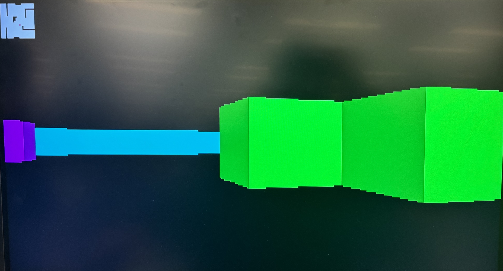
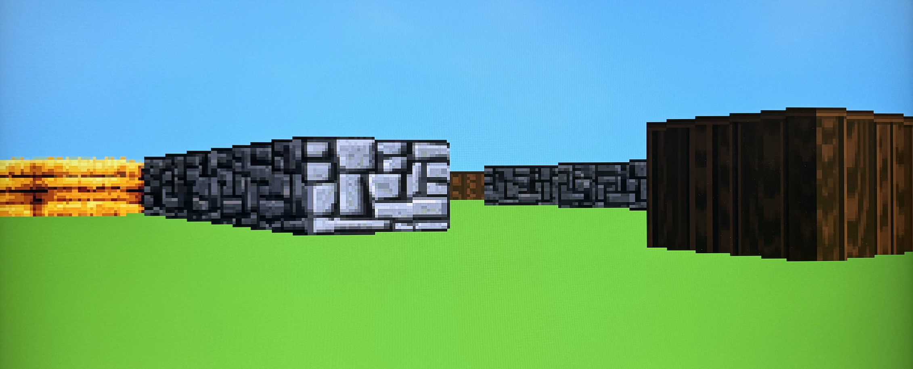
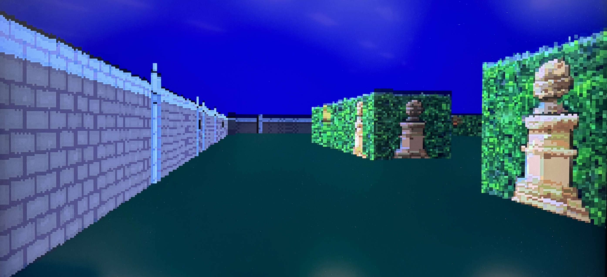
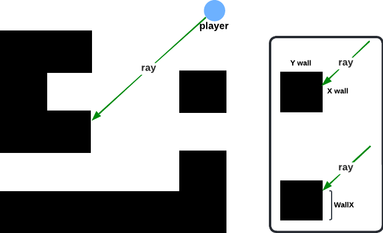
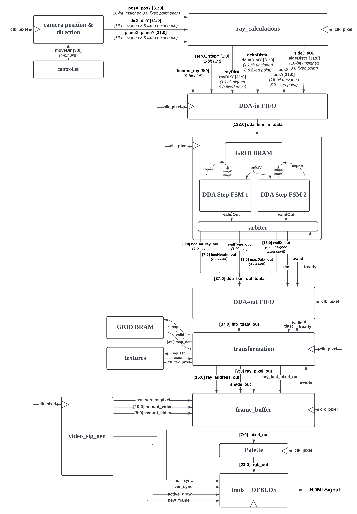
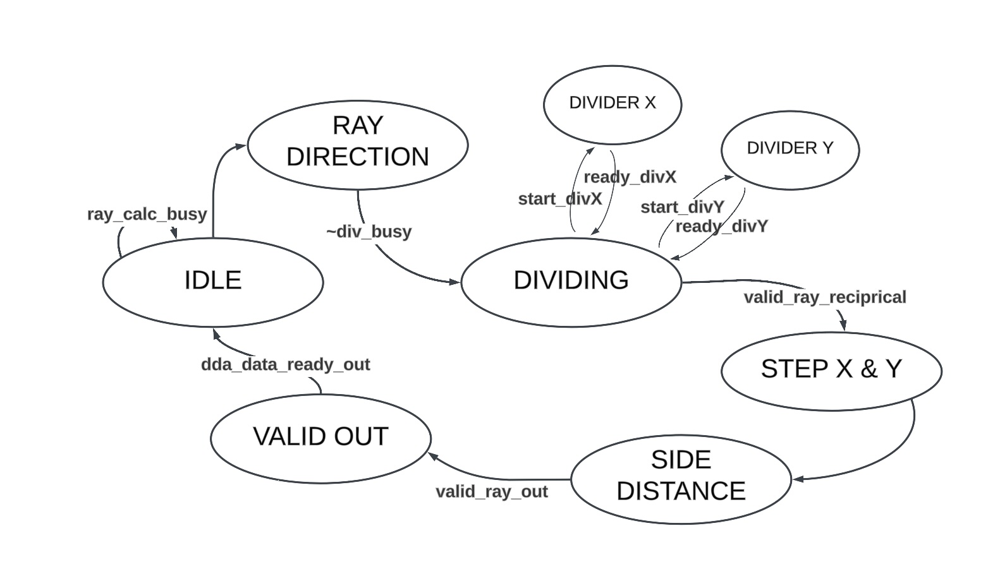
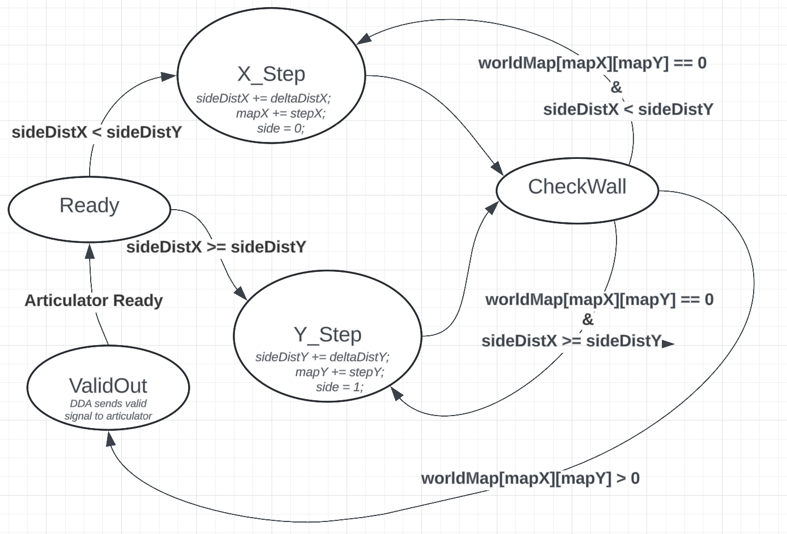
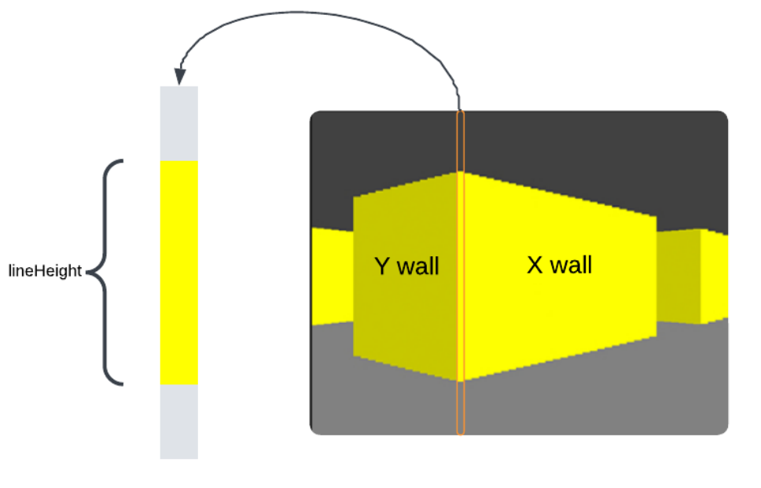
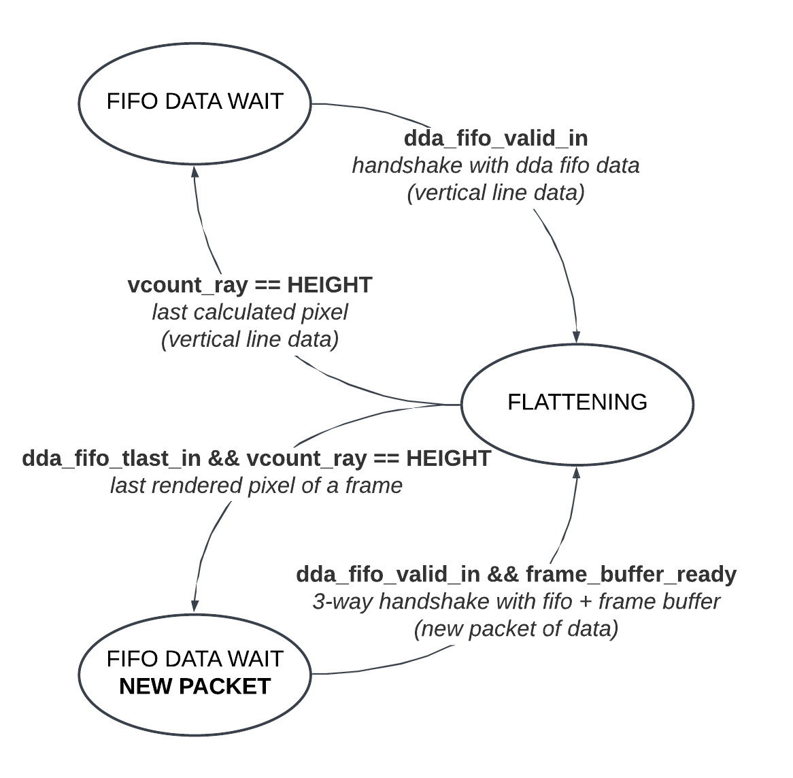
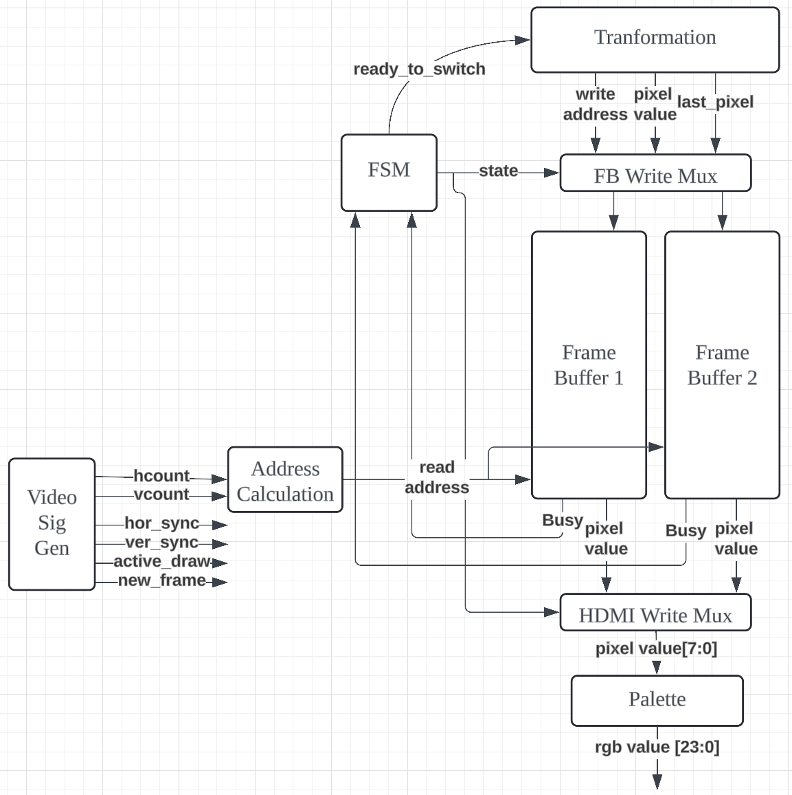

# mazecaster_fpga
This is our final project for 6.205 (Digital Systems Laboratory) Fall 2024 at MIT.

## Table of Contents
- [Description](#description)
- [Introduction](#introduction)
- [Controls & Ray Calculation](#introduction)
- [Ray Processing](#rayprocessing)
- [Frame Processing](#frameprocessing)
- [Evaluation](#evaluation)
- [Acknowledgements](#acknowledgements)

## Description
This project developed a pseudo-3D world renderer by ray-casting on an FPGA to simulate a first-person view within a 2D grid-based environment.

## Introduction
Ray-casting calculates intersections between the player's viewpoint and walls to render a 3D perspective, inspired by early 3D game engines. Leveraging FPGA hardware enables parallel processing of multiple rays, significantly accelerating rendering, increasing potential frame rates, and reducing latency compared to software implementations.

### Internal Map Representation
The map is structured as a 2D square grid, each square of length 1x1, where each cell represents either open space (0) or a wall (1 - numAvailableTextures), identified by a positive value that specifies its color or texture. The map data is stored in BRAM and the size of this BRAM, dependent on the grid dimension. The default grid size is 24x24, so the associated BRAM is 576 entries.

     
    <em>Raycasting Demonstration</em>
      
    
    <em>System Flowchart</em>

## Controls & Ray Calculation
The control system is composed of two modules: a button driver module and movement control module. These modules work together to enable player movement in our NxN grid map and are used to determine the player’s position, view direction, and field of view. Forward, backward, left rotation, and right rotation inputs are provided via a digital joystick connected to the FPGA through PMOD inputs.
### Button Driver
The joystick signals are debounced within the button driver to ensure clean transitions and reliable pulses for movement and rotation. The button driver consistently samples the debounced signals every 100 ms, generating single-cycle pulses for valid joystick movements to be sent to the movement controller, allowing for continuous movement. A few cycles later, the updated data is sent back into the button driver, which only applies changes to the global position and direction vectors when the `new_frame` signal is received. The `new_frame` signal indicates that the previous frame is done rendering. Synchronizing the `new_frame` signal with the movement controller ensures that inputs are properly accounted for, even while the previous position is rendering, and applied consistently at the start of each rendering cycle without disrupting downstream modules.
### Movement
Forward and backward movement are achieved by scaling the player’s direction vector by a constant speed of 0.1 and adding or subtracting it from the player’s position vector.

Right and left rotation is controlled using a constant angle of rotation per frame. Based on the input for left or right rotation, the controller transforms the player’s direction vector and plane vector using the rotation matrix.

Collision detection in the movement control module ensures that the player does not pass through walls while navigating the grid. Before updating the player’s position, the module checks that the next intended grid cell is empty by accessing the NxN grid stored in BRAM.

### Fixed-Point
The system uses fixed-point arithmetic for calculations. The default is Q8.8 format, which is represented by 1 sign bit, 7 integer bits, and 8 fractional bits. With this representation, we can represent values ranging from -128 to 127.99609375. Signed numbers are represented in two’s complement, simplifying arithmetic operations such as addition, subtraction, and multiplication. This representation allows for efficient computation of real-time player movement and rotation without the complexity and resource utilization of floating-point operations.

For the controller, the position, direction, and plane vectors are Q8.8 signed values. To achieve higher precision for smoother rotations, the rotation matrix trigonometric values are precomputed constants represented in Q2.14 format, which allows for 1 sign bit, 1 integer bit, and 14 fractional bits. Intermediate results are scaled back to Q8.8 representation for downstream use, balancing precision and balancing precision and compatibility with later logic. Similar adjustments are applied throughout the system wherever more accurate representations are needed.

This fixed-point representations extends to ray initialization, casting, and processing, where precise calculations are needed for determining ray directions and wall intersections. This fixed-point arithmetic also plays a critical role in ray initialization, casting, and processing, where precise calculations are needed to determine ray directions and wall intersections. To create a more accurate simulation and better help our debugging process, a Python implementation of the ray direction and DDA logic was developed to emulate our fixed-point arithmetic. Using the Simple Python Fixed Point Module (SPFPM) package, which supports binary fixed-point operations, we simulated hardware-like signals for verification of expected results.

### Ray Initializations
To render the scene, for each x-coordinate on the screen, a ray is cast from the player’s position. As the ray travels across the grid, it continues until it intersects with a wall cell (either x or y wall), which is calculated by the DDA.

The ray calculation module operates as a finite state machine (FSM), sequentially performing: (1) the ray direction computation. (2) the step and delta distance calculation. (3) the side distance initialization for the DDA algorithm.

     
    <em>Ray Calculation FSM</em> 

The ray’s direction is determined by the player’s direction, camera plane vector, and a variable known as `cameraX`, which normalizes the `hcount` within the FOV.
Delta distance is the distance the ray must travel in x and y to move from one grid cell to the next.

To calculate the delta distance, `deltaDist`, we had to handle a division, so we incorporated a signed divider module into our design with a signal flag to indicate when the 8.8 fixed-point division was complete, ensuring that the module would not move onto next calculation until the divides with ray directions in X and Y were complete.

The `stepX` and `stepY` values indicate the direction in which the ray will next move along the x and y axes (either +1 or -1), which is determined by evaluating the sign of `rayDirX` and `rayDirY`.

The corresponding `hcount` and calculated ray direction (`rayDirX` and `rayDirY`), delta distance (`deltaDistX` and `deltaDistY`), side distance (`sideDistX` and `sideDistY`), step vector (`stepX` and `stepY`), and player postion (`posX` and `posY`) are then passed into a FIFO buffer.

## Ray Processing
### Digital Differential Analyzer
The Digital Differential Analyzer (DDA) module is responsible for calculating ray-wall intersection distances and related hit information, including wall type and precise hit location. The DDA algorithm incrementally steps along a ray's path by precomputed steps deltaDist until it detects a wall intersection using grid map data. This information is used for perspective and texture rendering, providing wall height and shading details.
- DDA FIFOs: To handle the variable latency of the DDA algorithm, the DDA module is buffered with two FIFOs implemented via AXI stream interfaces: one for input data and one for output. These FIFOs ensure that preceding and following modules can operate independently at their own rates. The DDA input FIFO buffers ray data between the controller/ray calculation modules and the DDA module. It stores 139-bit wide inputs in a FIFO of size 144 × 256. The DDA output FIFO collects processed data from the DDA module into a single 38-bit wide data line stored in a FIFO of size 40 × 256.
- Grid Map in BRAM: An instance of the grid is stored in a single-port read-first Block RAM (BRAM) in the top level, where each cell contains data indicating wall type or passability. A shared arbiter resolves access conflicts between DDA FSM submodules, granting BRAM access alternately as needed.

### Parallel Processing with Finite State Machines (FSMs)
*Parallel DDA Finite State Machines (FSMs)*
The DDA algorithm has variable latency depending on the ray’s path. To manage this, two FSMs operate concurrently, independently calculating grid intersections for assigned rays. Each FSM:
- Steps along the ray, checking for wall intersections by indexing the grid map.
- Calculates the intersection parameters such as wall type, hit location, and distance.
Parallel operation ensures efficient utilization of resources and higher throughput. The outputs of the FSMs are multiplexed, routing valid data from the active FSM to the output bus.

*Perpendicular Wall Distance and Line Height*
In the `wall_calc` state of the DDA FSM, the height of the wall slice to render `lineHeight` is calculated as:
$$
\text{lineHeight} = \frac{\text{H}}{\text{perpWallDist}}
$$
This division is implemented using an unsigned 8.8 fixed-point division module.

*Ray Counter and Synchronization*
A ray counter tracks the number of rays processed in a frame. It generates a signal `tLast_out` to indicate the last ray in the frame, ensuring synchronization with the pixel rendering pipeline and marking frame boundaries.

## Frame Processing
To process and raster each frame, the vertical line output data of the DDA algorithm needs to be transformed into singular pixel data to be stored in some form of a frame buffer, which can then be displayed onto the screen at a specific frame rate.

### Data Transformation
For each horizontal position on the screen, the DDA algorithm described above effectively determines this corresponding set of vertical line data: `lineHeight`,`wallType`, `mapData`, and `wallX`
- `lineHeight` enables us to specify which pixels within the vertical line represent the wall and which represent the background.
- `wallType` tells us which face of the wall we have hit (which is used for the differential shading of different faces of a cube). 0 refers to a `X wall` and 1 refers to a `Y wall`
- `mapData` gives us a 4 bit representation of the color or texture of the specific block we’ve hit.
- `wallX` is the exact position of the wall we have hit which is used to index into the appropriate vertical stripe of the texture BRAM

The transformation essentially flattens this vertical line data into pixel-level information by providing a specified pixel color at a specified pixel address: (hcount, vcount) for each pixel in the frame.

Depending on the region of the screen in which the currently calculated pixel is from: `CEILING`, `FLOOR`, `PLAINWALL`, `TEXWALL`, `TOPDOWN`, the method of determining the pixel value is different.
- `CEILING` or `GROUND` region: The current pixel has fallen within the sky or ground region of the display, so a "sky" color and "floor" 8-bit color value corresponding to the current game world is assigned to the address of the pixel.
- `PLAINWALL` region: The current pixel is located within a solid colored wall, so the pixel color is simply combinationally determined based on the `mapData`.
- `TEXWALL` region: The current pixel is located within a textured block. A request is sent to the textures module (described in more detail below) which handshakes the corresponding pixel color by addressing into a texture BRAM that stores a contiguous set of texture data. This address is determined by mapping the (x,y) location of the pixel within the texture block on the screen into an (x,y) location within a texture block.
<!-- create a separate description of the textures module -->
- `TOPDOWN`: The current pixel is located within a square on the top left portion of the screen (from pixel (0,0) to pixel (23, 23)) which displays the position of the player within a top-down view of the maze. The blocks of the map of the maze are black, the open space is white, and the player's position is pink. For each of the pixels that land within this region, if the pixel's location corresponds to the player's position (`posX`, `posY`) on the map, the pixel's color is pink. Otherwise, a request is sent to a BRAM storing the map data to determine whether the pixel should display a black block, or a white space.
<!-- INCLUDE PICTURE LABELING DIFFERENT PARTS OF THE SCREEN!! -->

The three states within the transformation module:
Since the vertical line data used for this transformation calculation is taken from the DDA-out FIFO, there needs to be ready-valid handshakes between the FIFO and the transformation module so ensure data is robustly dequeued. Therefore, there are three states within the transformation module described below and in Figure 5: the `FIFO_WAIT`, `FIFO_WAIT_NEW_PACKET`, and `FLATTENING` states. 

- `FIFO_WAIT`: the transformation module signals to the FIFO that it’s ready for new data. Once new valid data is received from the FIFO, the data is stored in a register and the module transitions to the flattening state. 
- `FIFO_WAIT_NEW_PACKET`: After rendering the last pixel of a frame, the transformation module waits for an additional signal from the frame buffer to confirm that the frame buffer is done rasterizing to the screen and is ready to receive new frame data.
- `FLATTENING`: The module iterates through each vertical index (vcount) of the vertical line data at hcount and determines the pixel color based on the pixel's region at a latency also dependent on the pixel's region. Once this pixel data is received, it outputs the pixel address and color to store within the downstream frame buffer. Once all pixel values for a vertical line are calculated, the module transitions to either FIFO Wait or FIFO Wait New Packet, depending on whether the next vertical line data needed is from the same frame or a new frame.

Additionally, the `tlast` bit that accompanies each data set from the DDA-out FIFO enables the transformation module to signal to the downstream frame buffer when the last pixel of the current frame is being processed.

### Frame Buffer

There are two frame buffers which store the pixel data for each pixel location on the HDMI connected display. At any given moment, one of the frame buffers is being written to with the output of the preceding raycasting logic, while the other fully calculated frame buffer is being read from by the `video_signal` generation module to be displayed on the screen. This effectively pipelines the output to the display so that while one of them is still computing a frame, the other is outputting an already completed frame.

An FSM with two states is used to ensure the proper transition between frame buffers.
- State one: frame buffer 1 is being written to, while frame buffer 2 is being read from
- State two: frame buffer 2 is being written to, while frame buffer 1 is being read from

The module transitions to the opposite state when two conditions are met: 
- The video signal generation module sends the `video_last_pixel_in` signal, indicating it’s done outputting the reading frame to the screen
- The transformation module sends the `ray_last_pixel_out` signal, indicating it’s done filling the writing frame with the fresh pixel values of the currently calculated frame.

## Evaluation
Our system can be assessed based on rendering speed, smoothness, and resolution. 

There is no limitation on rendering speed from the ray casting logic of the system, as the limiting factor for the rasterization is purely the 60 frames per second HDMI video signal generation. In other words, the frame is swiftly calculated in time to be rendered onto the screen at 60 frames per second.

The slack for our system is positive 2.8 ns. To combat earlier issues with negative slack, complex logic with multiplies and additions with fixed point values were broken down into simpler stages through pipelining and increased FSM stages. 

Resolution was our main limiting factor due to the BRAM limitations on the Xilinx FPGA. This project used 2271 LUTs, 21 DSP blocks, and totaled out the BRAM storage of 2.7Mbits on the Xilinx Urbana FPGA. This is due to the usage of BRAMs for four different locations on the FPGA: Frame Buffers, FIFOs, Texture storage, and Grid Map storage. To combat the BRAM storage limitations, trade-offs were made with the color depth and precise definition of the pixels on the screen. First, the rendered virtual screen is one-fourth the dimensions of the actual 1280x720 screen, which decreases screen resolution by 4-fold. The internal pixel representation was also compressed to 8-bits, constraining the color range to 256 colors. The 22 textures were constrained to 64x64 blocks and stored contiguously in a BRAM accessed using addressing offsets to reduce unnecessary instantiations of BRAM. The map data was also stored contiguously in a BRAM with addressing offsets to access different maps.

Further optimizations to the resolution and BRAM usage could be performed in the future by migrating to DRAM usage, also allowing for the storage of more grid maps and textures. 

During the course of this project, the main source of issues we ran into resulted from handshaking issues. However, these handshaking issues were directly present as artifacts on the screen, which aided in the debugging process. 

In conclusion, we fulfilled our minimum viable product of being able to render a grid into an interactive pseudo-3D perspective with shading, and a majority of our stretch goals which included creating a game fsm, adding many textures on the walls, adding multiple maps, and a top down view in the corner of the screen.

## Acknowledgements
We would like to acknowledge our project mentor Kailas Kahler and our instructor Joe Steinmeyer for their extensive guidance and invaluable support throughout this project. We would like to sincerely thank both of you and the rest of the 6.205 Fall 2024 course staff for making this project possible.

## Bibliography
L. Vandevenne, Computer Graphics Tutorial: Raycasting. [Online]. Available: https://lodev.org/cgtutor/raycasting.html. [Accessed: Nov. 27, 2024].

Pikuma, Raycasting Engine Tutorial: Algorithm \& JavaScript. [Online]. Available: https://pikuma.com/courses/raycasting-engine-tutorial-algorithm-javascript. [Accessed: Nov. 27, 2024].

Green, Will, Project F, Division in Verilog. [Online]. Available: https://projectf.io/posts/division-in-verilog/. [Accessed: Nov. 27, 2024].

R. W. Penney, spfpm: Simple Floating Point Precision Math. [Online]. Available: https://pypi.org/project/spfpm/. License: PSF Python License. Tags: arithmetic, fixed-point, trigonometry, arbitrary precision. [Accessed: Nov. 27, 2024].